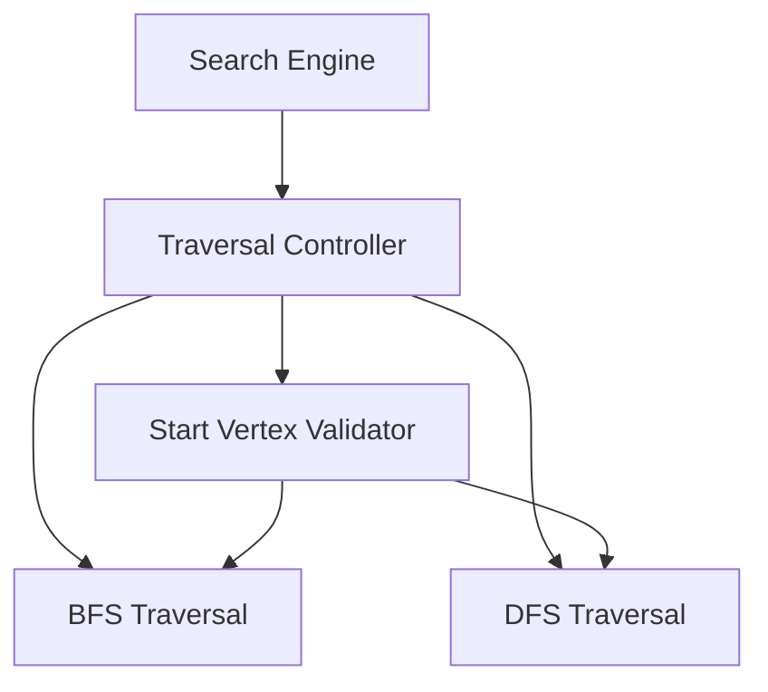

# C4 Level 3 – Component Diagram

## Components inside the Search Engine container

## Component Responsibilities

| Component | Responsibility |
|---|---|
| Traversal Controller | Selects BFS or DFS and coordinates traversal execution. |
| Start Vertex Validator | Checks that the requested start vertex exists in the graph. |
| BFS Traversal | Performs level-wise traversal using a queue. |
| DFS Traversal | Performs depth-first traversal using recursion or a stack. |

Only the **Search Engine** is decomposed at this level, keeping the C4 diagram simple as required for SLE-3.
