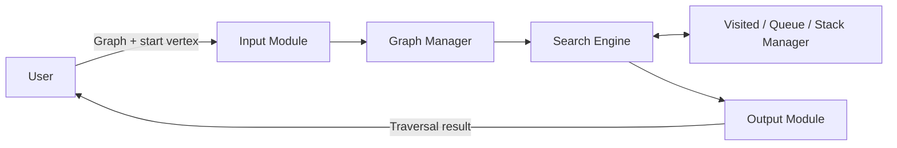

# C4 Level 2 – Container Diagram

## BFS and DFS Graph Search System

## Container Responsibilities

| Container | Responsibility |
|---|---|
| Input Module | Accepts graph, starting vertex and search choice from the user. |
| Graph Manager | Stores and provides the graph/adjacency representation. |
| Search Engine | Runs BFS or DFS according to the selected search method. |
| Visited / Queue / Stack Manager | Maintains visited vertices and the data structures required during traversal. |
| Output Module | Formats and displays the BFS/DFS traversal result. |

The design uses five containers, keeping the diagram within the recommended 4–7 boxes for readability.
