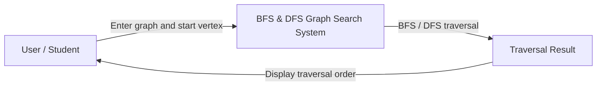

# C4 Level 1 – Context Diagram

## BFS and DFS Graph Search System

### Explanation

The user provides a graph and a starting vertex to the BFS/DFS Graph Search System. The system performs BFS or DFS traversal and produces the traversal order as the result. The result is displayed back to the user.
